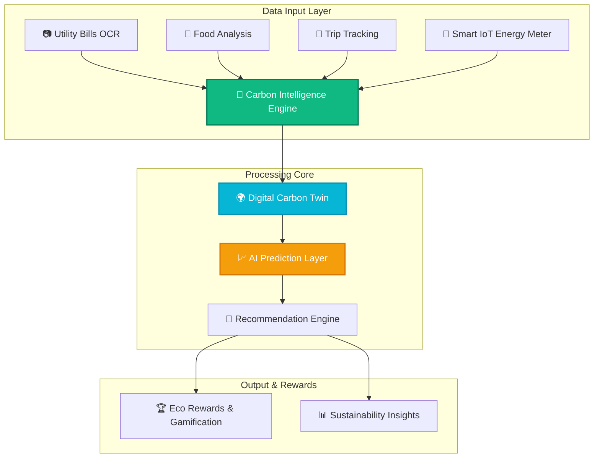
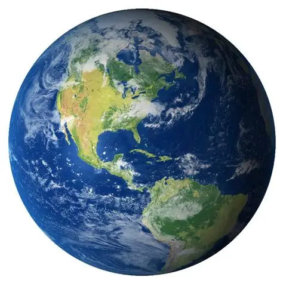
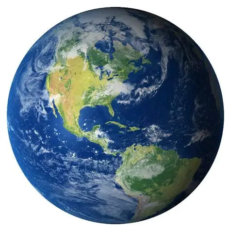
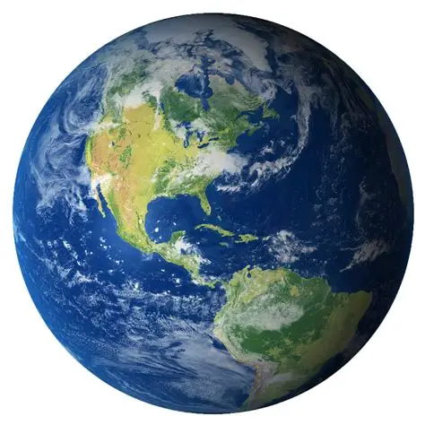
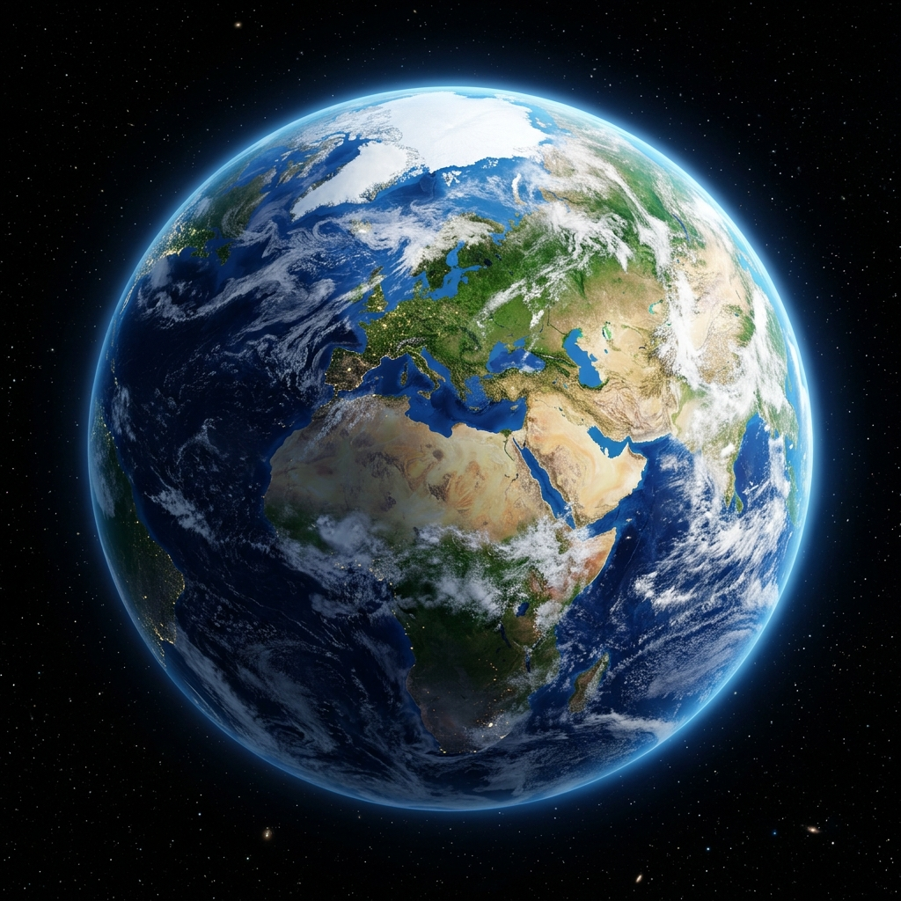

# 🌍 TerraTwin AI

## See Your Carbon Future Before It Happens

TerraTwin AI is an AI-powered Digital Carbon Twin platform that helps individuals understand, predict, and reduce their carbon footprint through automated tracking, intelligent forecasting, and personalized sustainability recommendations.

Unlike traditional carbon trackers that only report past emissions, TerraTwin creates a living digital twin of a user's environmental behavior and simulates future outcomes before emissions occur.

> [!IMPORTANT]
> **Quick Start Guide for Judges & Users:**
> 1. Launch the web application and click **Get Started** or **Launch TerraTwin** on the home page.
> 2. On the authentication console, click **"Create an account"** (Register) to set up your profile credentials.
> 3. Log in to access the interactive **Digital Twin Dashboard**, view the 3D living Earth, adopt AI recommendations, and track live activity logs.

---

# 🚀 Problem Statement

Most carbon footprint applications suffer from three major limitations:

* **Manual data entry** creates user friction.
* **Carbon reports** only show historical emissions.
* **Generic recommendations** fail to drive behavioral change.

Users often lack visibility into how today's decisions impact future environmental outcomes.

---

# 💡 Our Solution

TerraTwin AI creates a personalized Digital Carbon Twin that continuously learns from:

* **Utility Bills**
* **Food Consumption**
* **Transportation Habits**
* **Energy Usage**
* **User Activities**

The platform predicts future emissions, simulates alternative scenarios, and recommends personalized actions that help users reduce their environmental impact.

---

# ✨ Key Features

### 🌍 Digital Carbon Twin
Creates a living representation of a user's carbon behavior and environmental impact.

### 📈 AI Carbon Prediction
Forecasts future emissions using historical activity patterns and sustainability metrics.

### 📷 AI Bill Scanner
Uses OCR and AI vision to extract utility usage and automatically calculate carbon emissions.

### 🍔 Food Carbon Analyzer
Analyzes meals and estimates associated carbon footprints.

### 🚗 Smart Trip Tracker
Tracks transportation activities and estimates travel-related emissions.

### 🤖 EcoBot Assistant
Provides personalized sustainability insights and recommendations.

### 🔮 What-If Scenario Simulator
Allows users to test alternative lifestyle decisions and compare future carbon outcomes.

### 📖 AI Carbon Story Generator
Generates monthly sustainability reports and environmental impact summaries.

### 🔒 Privacy Engine
Ensures transparency through local-first processing and privacy audits.

### 🏆 Challenges & Rewards
Encourages sustainable habits through gamification, achievements, and eco-rewards.

---

# ⚙️ How TerraTwin Works

1. User uploads bills, scans meals, or tracks trips.
2. AI extracts environmental activity data.
3. Carbon Intelligence Engine calculates emissions.
4. Digital Twin updates in real-time.
5. AI predicts future carbon footprint.
6. Personalized recommendations are generated.
7. Users simulate improvements and track progress.

---

# 🏗️ System Architecture



---

# 🛠️ Technology Stack

### Frontend
* **React** & **TypeScript** (Interactive single page application)
* **TailwindCSS** (Custom dark-theme premium aesthetics)
* **Framer Motion** (Responsive animations & real-time transitions)
* **Recharts** (Visualizing future prediction trends)

### Backend
* **Node.js** & **Express** (REST API)
* **Prisma ORM** (Database client abstraction)
* **PostgreSQL** / **SQLite** (Activity & profile persistence)
* **Socket.io** (Real-time IoT smart meter event propagation)

### AI Layer
* **Google Gemini API** (Vision analysis for meal & utility document scans)
* **OCR Text Parsing** (Context extraction)
* **Carbon Intelligence Engine** (Mathematical calculation logic)

### Additional Technologies
* **WebSockets** (Real-time digital twin health streaming)
* **Docker** (Production-grade container configuration)
* **Blockchain Reward Mock Layer** (Simulating immutable Eco-Reward verification)

---

# 🌟 Why TerraTwin AI?

| Feature | Traditional Carbon Tracker | TerraTwin AI |
| :--- | :--- | :--- |
| **Temporal Scope** | Tracks Past Emissions | Predicts Future Emissions |
| **User Onboarding** | Manual Data Entry | AI-Powered Automation |
| **Insights** | Generic Static Reports | Personalized Digital Twin |
| **Recommendations** | Static Tips | Dynamic AI Guidance |
| **Forecasting** | No Simulation | What-If Carbon Forecasting |

---

# 📊 Impact

TerraTwin AI helps users:
* **Understand** their exact environmental impact.
* **Predict** future emissions before they occur.
* **Reduce** carbon footprints proactively.
* **Build** long-term sustainable habits.
* **Make** data-driven environmental decisions.

---

# 🔐 Privacy First

TerraTwin AI was designed with privacy as a core principle.
* **No SMS Access**
* **No Banking Access**
* **No Contacts Access**
* **Transparent Privacy Audit Logs**
* **Local Processing** wherever possible.

Users maintain full, absolute control over their sustainability data.

---

# 🚀 Future Scope

* **Smart Home Integration** (Automated thermostat/plug controllers)
* **Real-Time IoT Energy Monitoring** (Hardware smart meters integration)
* **Community Sustainability Challenges** (Social gamification modules)
* **Advanced AI Forecasting Models** (LSTMs predicting seasonal consumption shifts)
* **Carbon Offset Marketplace** (Direct token exchange for verified offsets)

---

# 📸 Visualizing the Twin (Screenshots)

### 1. Landing Page
*TerraTwin AI — See your carbon future before it happens.*


---

### 2. Dashboard
> Main sustainability dashboard with Digital Twin metrics.


---

### 3. TerraTwin AI Predictor
> AI-powered Digital Carbon Twin forecasting future emissions.


---

### 4. What-If Simulator
> Simulate lifestyle changes and compare environmental outcomes.


---

### 5. AI Bill Scanner
> AI-powered utility bill analysis and carbon estimation.


---

### 6. EcoBot Assistant
> Personalized sustainability recommendations powered by AI.


---

### 7. Carbon Story Generator
> AI-generated monthly environmental impact summary.


---

### 8. Privacy Dashboard
> Privacy-first architecture with transparent audit controls.


---

### 9. Challenges & Leaderboards
> Gamified sustainability challenges and rewards.


---

### 10. Earth Health Evolution
> Living Earth visualization reflecting sustainability progress.


---

# ⚙️ Environment Variables

Create a `.env` file in the `/backend` folder with the following properties:

```env
PORT=5000
DATABASE_URL="file:./dev.db"
JWT_SECRET="YOUR_JWT_SUPER_SECRET_KEY"
GEMINI_API_KEY="YOUR_GEMINI_API_KEY" # Optional: falls back to simulation mode if not provided
```

---

# 🛠️ Installation Guide

### Prerequisites
* **Node.js** (v18.x or above)
* **npm** (v9.x or above)

### 1. Clone & Set Up Directory
```bash
git clone https://github.com/your-repo/nextgen_carbonfootprint.git
cd nextgen_carbonfootprint
```

### 2. Configure Backend
```bash
cd backend
npm install
# Set up Prisma Database
npx prisma generate
npx prisma migrate dev --name init
```

### 3. Configure Frontend
```bash
cd ../frontend
npm install
```

### 4. Start Development Servers
* **Backend Dev Server** (runs on port `5000`):
  ```bash
  cd backend
  npm run dev
  ```
* **Frontend Dev Server** (runs on port `5173`):
  ```bash
  cd frontend
  npm run dev
  ```

---

# 🚀 Deployment Guide

### Deploying the Backend (Node.js/Express)
1. **Prepare for Build**:
   Compile TypeScript backend code:
   ```bash
   cd backend
   npm run build
   ```
2. **Containerization (Optional)**:
   A standard `Dockerfile` handles environment isolation:
   ```dockerfile
   FROM node:18-alpine
   WORKDIR /app
   COPY package*.json ./
   RUN npm install --production
   COPY . .
   RUN npx prisma generate
   EXPOSE 5000
   CMD ["npm", "start"]
   ```

### Deploying the Frontend (Vite/React)
1. **Compile Production Bundle**:
   ```bash
   cd frontend
   npm run build
   ```
2. **Serve Built Assets**:
   Vite outputs code in `/dist`. These static assets can be uploaded to **Vercel**, **Netlify**, or **AWS S3** with standard caching headers.

---

# 📖 API Documentation

All API endpoints are prefixed with `/api`.

### 🔐 Authentication

#### `POST /auth/register`
*Registers a new user and returns a session token.*
* **Body Parameters**:
  ```json
  {
    "name": "Jane Doe",
    "email": "jane@example.com",
    "password": "supersecretpassword",
    "monthlyGoal": 250.0
  }
  ```
* **Response**: `201 Created` with JWT session token.

#### `POST /auth/login`
*Authenticates user and initiates session.*
* **Body Parameters**:
  ```json
  {
    "email": "jane@example.com",
    "password": "supersecretpassword"
  }
  ```
* **Response**: `200 OK` with JWT session token.

### 🌍 Carbon Activity Logs

#### `GET /carbon`
*Retrieves all logged activity entries.*
* **Headers**: `Authorization: Bearer <token>`
* **Response**: `200 OK` with array of logs.

#### `POST /carbon`
*Manually registers a carbon activity.*
* **Headers**: `Authorization: Bearer <token>`
* **Body Parameters**:
  ```json
  {
    "category": "transport",
    "type": "car",
    "value": 15.5,
    "unit": "km",
    "carbonEmitted": 3.1,
    "source": "manual"
  }
  ```
* **Response**: `201 Created` with saved entry object.

---

# 👥 Team

**Team Name:** TerraTwin AI

Built for sustainability, environmental awareness, and intelligent carbon reduction.

---

# 🌱 Final Thought

TerraTwin AI does not simply calculate carbon footprints.

It helps users see their carbon future before it happens and empowers them to make better environmental decisions through AI-powered digital twin technology.
